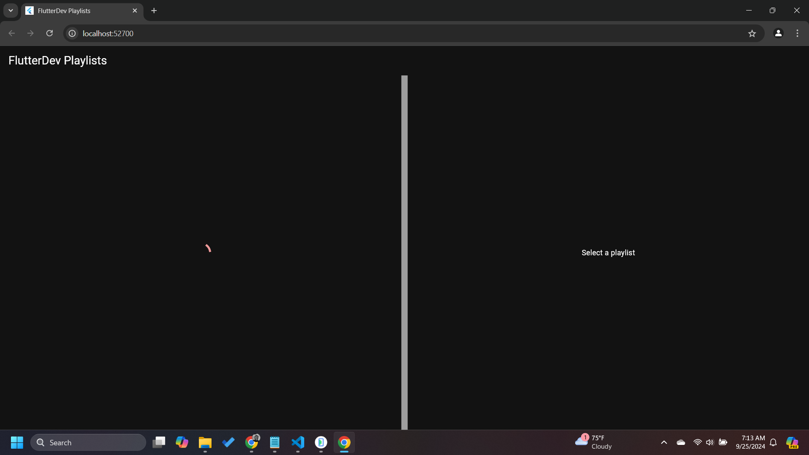
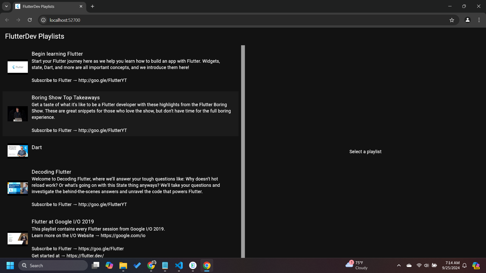
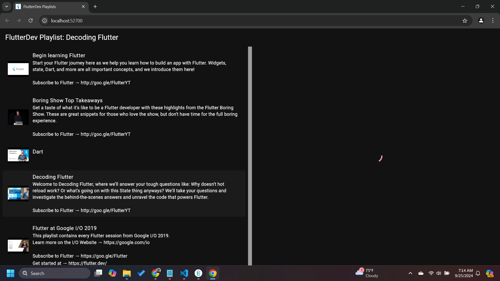
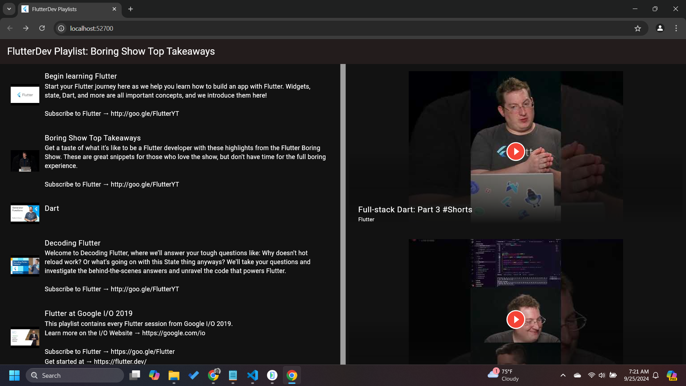

# adaptive_app 
I implemented a Google codelab, an adaptive Flutter app that runs on all six platforms that Flutter supports. I adapted the code to handle differences in how screens are layed out, how text is interacted with and how images are loaded,

## Key Concepts Learnt
- How to grow a Flutter app designed for mobile to work on all six platforms supported by Flutter.
- The different Flutter APIs for platform detection and when to use each API.
- Adapting to the restrictions and expectations of running an app on the web.
- How to use different packages alongside each other to support the full range of Flutter's platforms.

## Mobile Screenshots
 
 
 

## Desktop Screenshots
 
 
 
 

### Supporting Platforms
- Android 
- iOS
- Web
- Linux 
- Windows
- MacOS

### Best Practices
- For decisions that are not dependent on platform specific capabilities, use Theme.of(context).platform. A primary example of this is adapting the ordering of buttons to conform to operating system idioms. Most adaptive code should use this approach to adapt to different platforms.
- For decisions that depend on platform specific capabilities, use the [kIsWeb constant](https://api.flutter.dev/flutter/foundation/kIsWeb-constant.html) along with [isAndroid](https://api.dart.dev/stable/2.14.2/dart-io/Platform/isAndroid.html), [isIOS](https://api.dart.dev/stable/2.14.2/dart-io/Platform/isIOS.html) and friends from dart:io's Platform class. A capability difference example is the browser requirement for [CORS headers](https://developer.mozilla.org/en-US/docs/Web/HTTP/CORS) on cross domain requests.
- One way to deal with the image rendering issues is to introduce a proxy web service to add in the required Cross Origin Resource Sharing headers.
- dart create --template server-shelf yt_cors_proxy
- dart pub add shelf_cors_headers http

[Check out the codelab here.](https://codelabs.developers.google.com/codelabs/flutter-adaptive-app)

